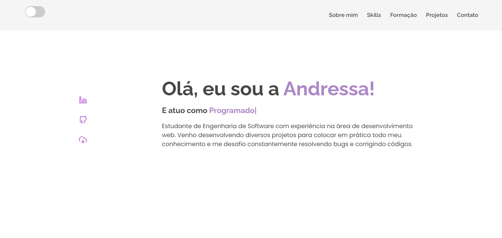

# Portfólio

Bem-vindo ao meu portfólio! Aqui você encontrará uma coleção de meus projetos, habilidades e experiências.

## Sobre Mim

Sou a Andressa Turchetto, uma desenvolvedora Web com interesse em tecnologia. Tenho experiência em Angular e Node.js e estou sempre em busca de aprender mais.

## Projetos

Aqui estão alguns dos meus projetos.

## Habilidades

- Angular
- JavaScript
- TypeScript
- HTML
- CSS
- TAILWIND
- BOOTSTRAP
- CHATGPT e IA
- TESTES COM JEST
- WORDPRESS
- FIGMA e FUNDAMENTOS DE DESIGN
- SCRUM e KANBAN
- SEO e ACESSIBILIDADE  
- GIT e GITHUB
- MODELAGEM DE DADOS
- MARIA DB | MySQL
- SWAGGER
- FUNDAMENTOS AWS
- SO: WINDOWS e LINUX
- MICROSSERVIÇOS | ARQUITETURA DE SOFTWARE

## Contato

Se você deseja entrar em contato, fique à vontade para me enviar um e-mail para and.turchetto@gmail.com ou me encontrar nas redes sociais:

- [LinkedIn](https://www.linkedin.com/in/andressadev/)
- [GitHub](https://github.com/AndressaTurchetto/)

Obrigado por visitar meu portfólio!

## Clonando o Repositório

Para clonar este repositório, você pode usar o seguinte comando Git:

git clone https://github.com/AndressaTurchetto/portfolio-one.git

## Capturas de Tela

Aqui estão algumas capturas de tela do meu portfólio:

